# Frontend gallery

This is a visual archive of the NvStrapsReBar Tauri frontend, from guarded
configuration to the deployment workflow. The current concept-first surfaces
are shown first; earlier captures remain below as revision history.

> [!IMPORTANT]
> These captures come from the production Chromium build running the
> repository's browser-preview fixtures. They demonstrate the embedded client
> layout and mocked journey only. They do **not** prove native WebView2
> behavior, native dialogs, firmware reads or writes, flashing, reboot, or
> NVIDIA hardware results.

The 900 px captures show the app's supported minimum **desktop** window. The
gallery uses one image per section so it remains comfortable to browse on a
phone; it does not imply a mobile app or a 390 px application viewport.

## Current concept-first surfaces

These captures show the two-step journey shell: a header tagline that states
what the program does, a step navigation (1. Install firmware, 2. BAR
Settings) with completion marks, and a status hero that draws the BAR
aperture itself — a small 256 MiB block expanding into the multi-GiB target.

### 21. BAR Settings with the expansion hero

The default surface once the driver left evidence in the current boot. The
hero shows the expanded aperture as a filled bar and the first panel is the
Resizable BAR expansion switch.

[Open full-size image](21-concept-hero-bar-settings-1180x760.png)

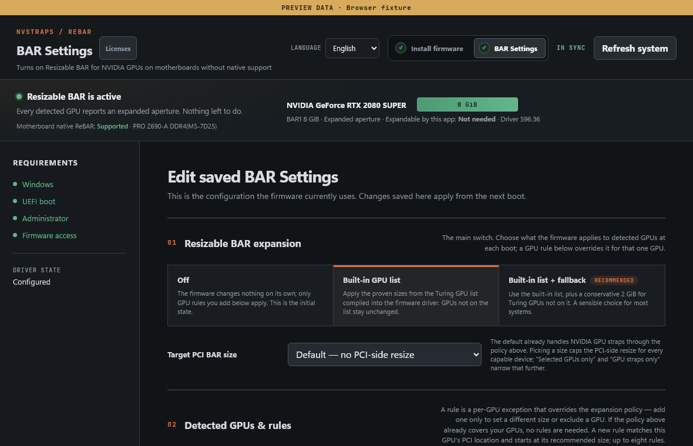

### 22. 설치 전 안내와 확장 목표

드라이버 증거가 없으면 1단계(펌웨어 설치)가 열리고, 히어로가 256 MiB 창과
점선으로 그린 확장 목표, 그리고 다음 할 일을 한 줄로 보여줍니다.

[원본 크기로 보기](22-concept-korean-install-step-900x760.png)

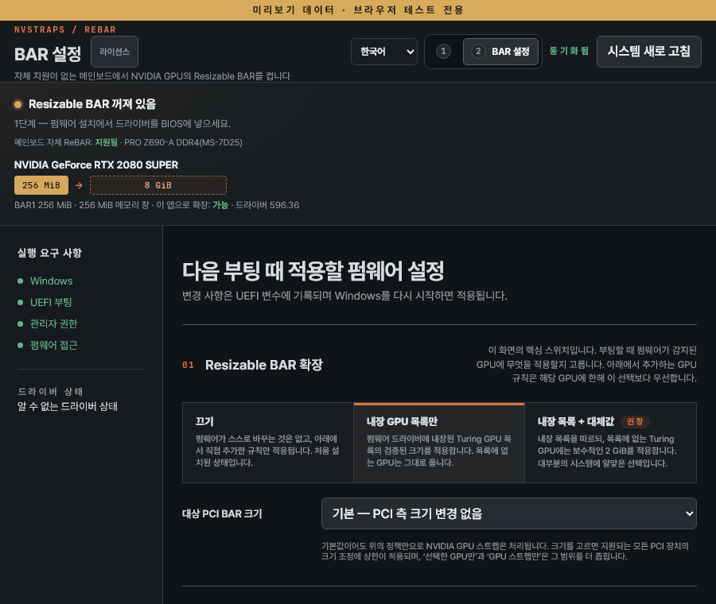

### 23. GPU마다 다른 상태를 그대로 그리기

혼재 상태에서는 GPU별로 확장 완료 바와 256 MiB → 목표 바가 나란히 그려져
어떤 GPU가 아직 확장 가능한지 즉시 드러납니다.

[원본 크기로 보기](23-concept-korean-mixed-900x760.png)

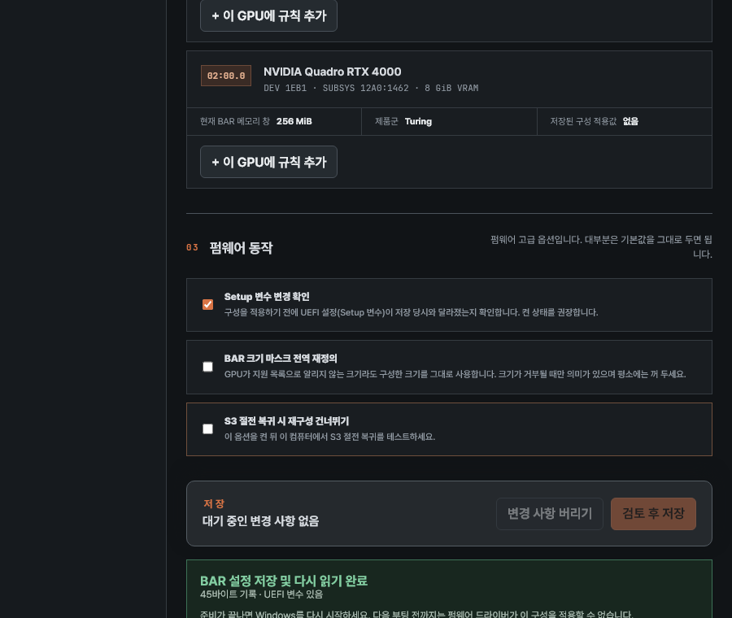

## Current factual-copy surfaces — `ffe4de9`

These four captures show the current English and Korean deployment copy. The UI
states detected hardware, selected files, operation results, and the next user
action without presenting internal profile IDs, plan revisions, receipts, or
backend ownership as reassurance.

### 13. Select the firmware image

The English deployment screen names the detected MSI board and selected image,
including its size and SHA-256. It tells the user to continue with the vendor
tool instead of describing the app's internal safety mechanisms.

[Open full-size image](13-factual-english-deployment-1180x760.png)

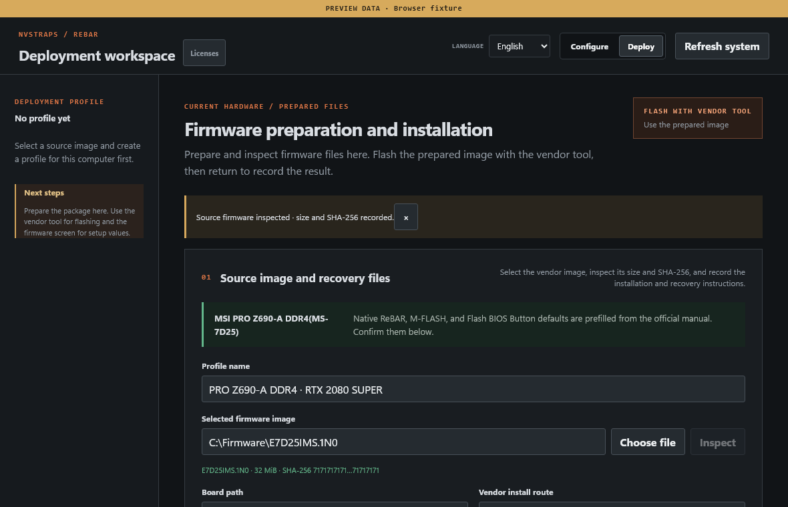

### 14. Review the recommended configuration

The active step shows the current GPU and PCI-topology recommendation, the
configuration values, and the review action. The sidebar keeps the profile
display name and active step while internal IDs and plan revisions stay out of
the routine UI.

[Open full-size image](14-factual-english-recommendation-1180x760.png)

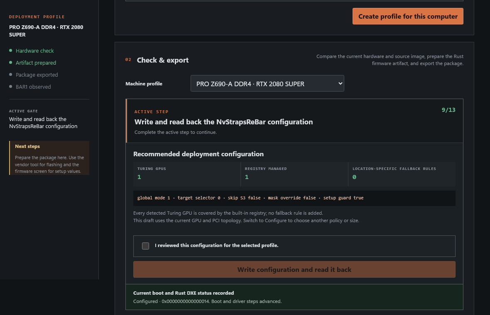

### 15. 펌웨어 이미지 선택

한국어 화면도 감지한 MSI 보드, 선택한 이미지, 크기, SHA-256을 그대로
보여줍니다. 앱의 안전성을 설명하는 대신 제조사 도구에서 이어서 진행할
작업을 안내합니다.

[원본 크기로 보기](15-factual-korean-deployment-1180x760.png)

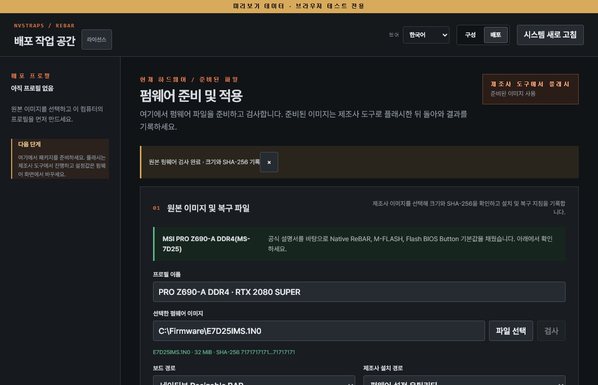

### 16. 권장 배포 구성 검토

최소 지원 폭 900 px에서 현재 GPU와 PCI 구성에 맞춘 값, 검토 확인란,
다음 작업을 확인할 수 있습니다. 프로필 ID나 계획 리비전 같은 내부 정보는
화면에 표시하지 않습니다.

[원본 크기로 보기](16-factual-korean-recommendation-900x760.png)

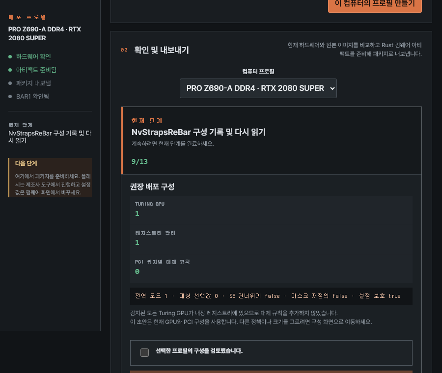

## Earlier interface captures

The captures below are retained as visual revision history. Their older labels
and workflow copy do not describe the current `ffe4de9` interface.

## 1. Configure at a glance

Detected hardware, the global policy, target BAR size, and explicit GPU rules
stay visible in one desktop workspace.

[Open full-size image](01-configure-overview-1180x760.png)

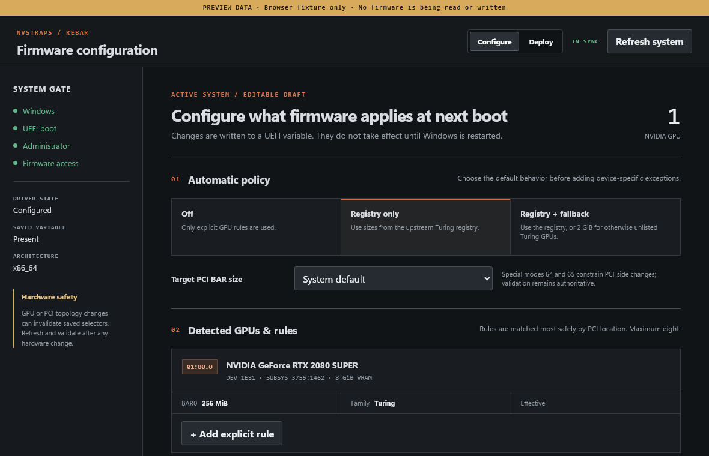

## 2. Review a consequential write

Changing policy creates an unsaved draft. The final dialog names the UEFI
write, restart consequence, topology check, and read-back verification before
continuing.

[Open full-size image](02-save-confirmation-900x760.png)

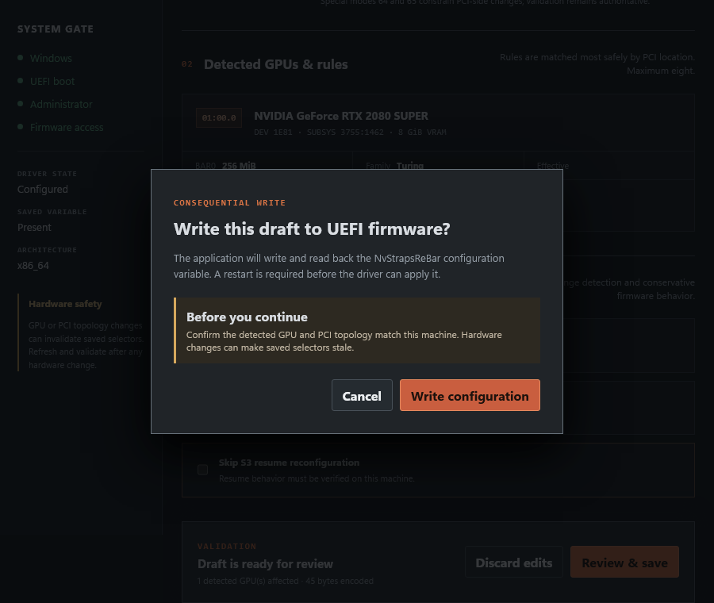

## 3. Pin the exact machine and recovery route

Deployment begins with one inspected vendor image, immutable machine identity,
documented install route, and physical recovery plan. The preview banner and
**NO AUTO-FLASH** boundary remain visible.

[Open full-size image](03-machine-profile-1180x760.png)

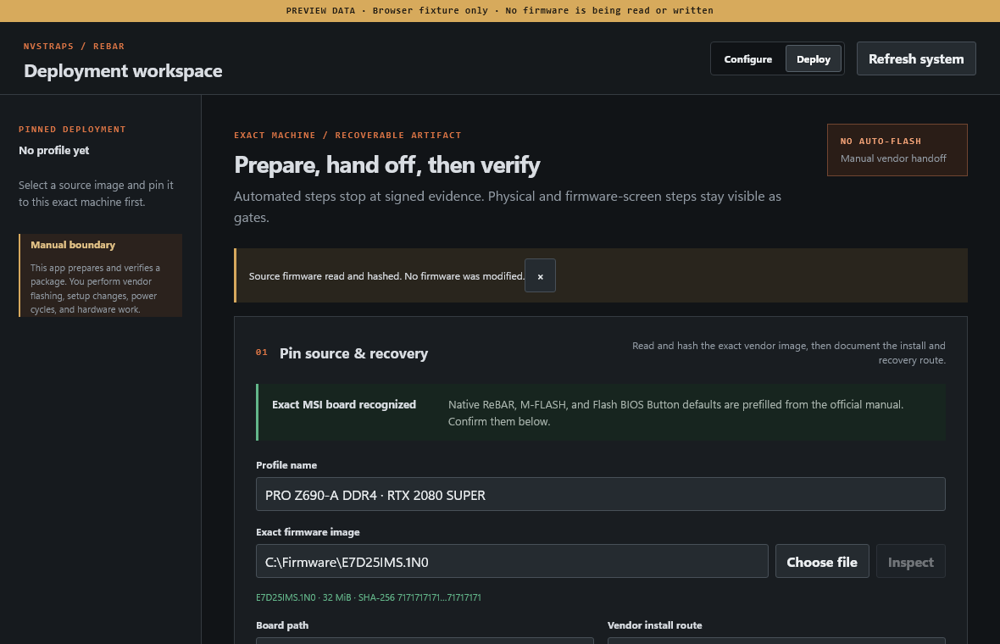

## 4. Stop at the vendor-owned flash gate

After the repository verifies a derived artifact, the plan advances to a
manual vendor handoff. Preparation is kept distinct from flashing, and the
active step is still explicit at the 900 px desktop minimum.

[Open full-size image](04-manual-flash-gate-900x760.png)

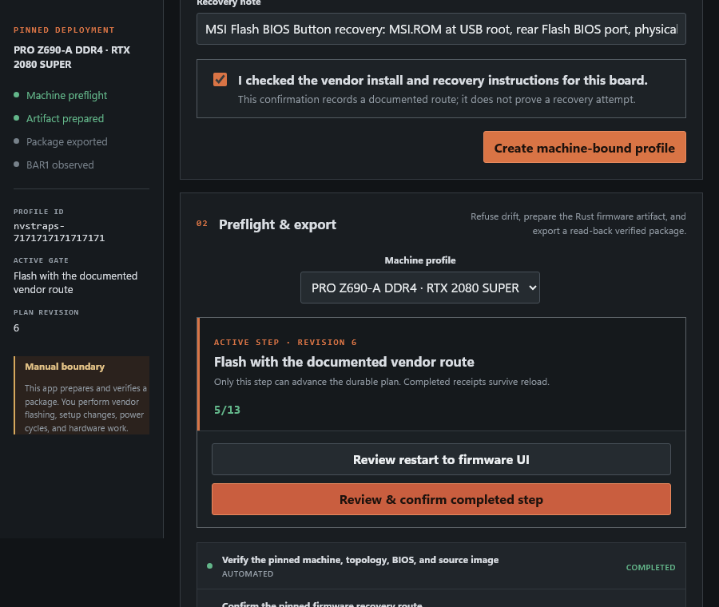

## 5. Bind legacy risk to one firmware fingerprint

Read-only legacy analysis separates a recommended rule, a blocked rule, and a
risky DSDT modification. Selecting the risky rule requires a note and
confirmation tied to the exact analyzed image.

[Open full-size image](05-legacy-risk-acknowledgement-900x760.png)

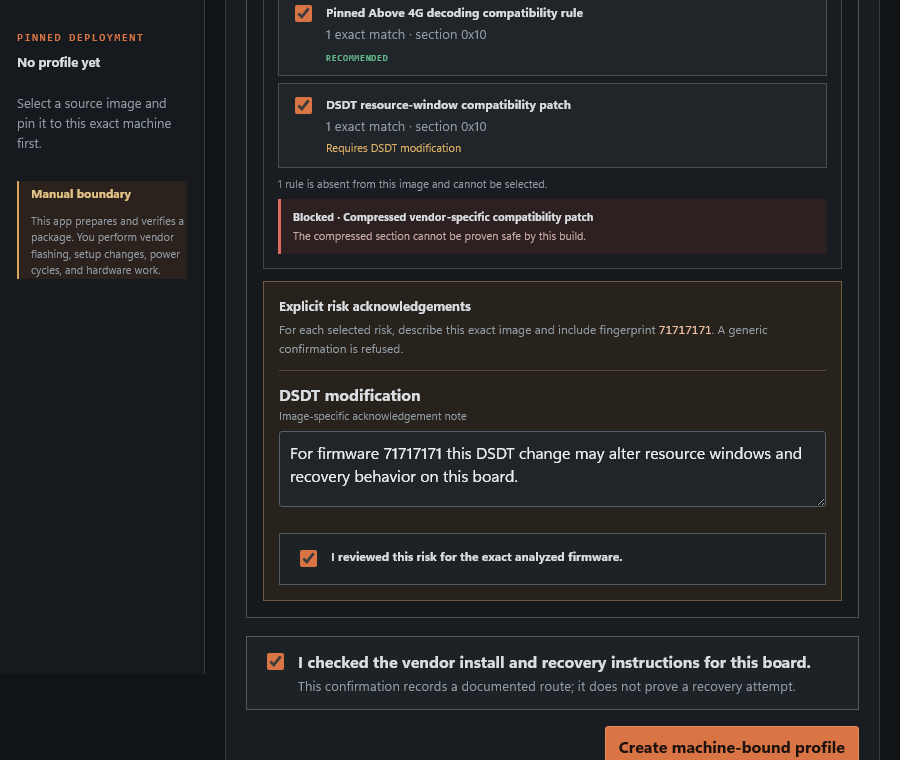

## 6. Review the backend-owned recommendation

After current-boot and Rust DXE verification, the active plan step shows the
exact registry and fallback recommendation. The guarded write stays disabled
until the selected profile's recommendation is reviewed.

[Open full-size image](06-backend-recommendation-1180x760.png)

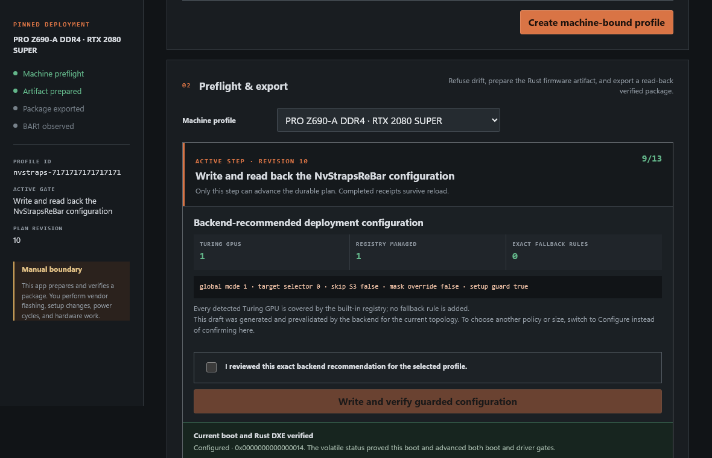

## 7. 한국어로 구성 확인

언어를 바꾸면 페이지를 새로 불러오지 않아도 구성 화면, 접근성 이름,
상태 문구가 바로 한국어로 바뀝니다. 편집 중인 초안과 선택값은 그대로
유지됩니다.

[원본 크기로 보기](07-korean-configure-1180x760.png)

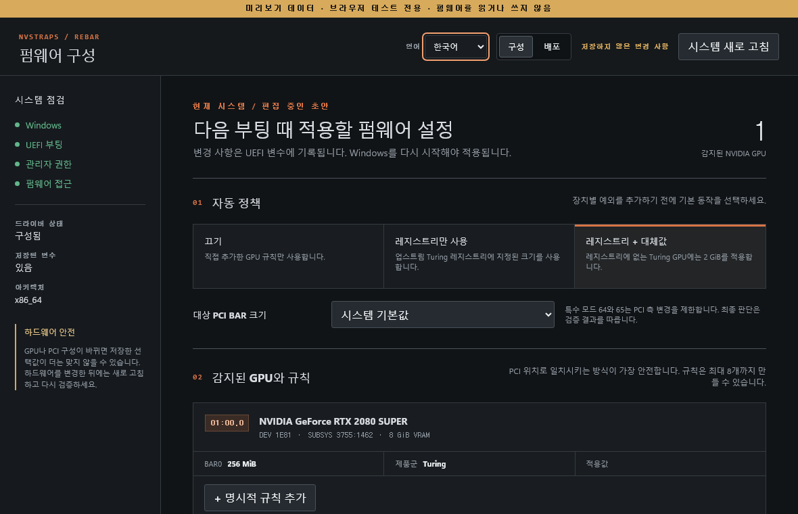

## 8. 한국어로 배포 권장 구성 검토

최소 지원 폭 900 px에서도 현재 단계, 백엔드 권장 구성, 검토 확인란이
한 화면에 들어옵니다. 해시, 장치 이름, 선택자 값 같은 기술 정보는
번역하지 않습니다.

[원본 크기로 보기](08-korean-recommendation-900x760.png)

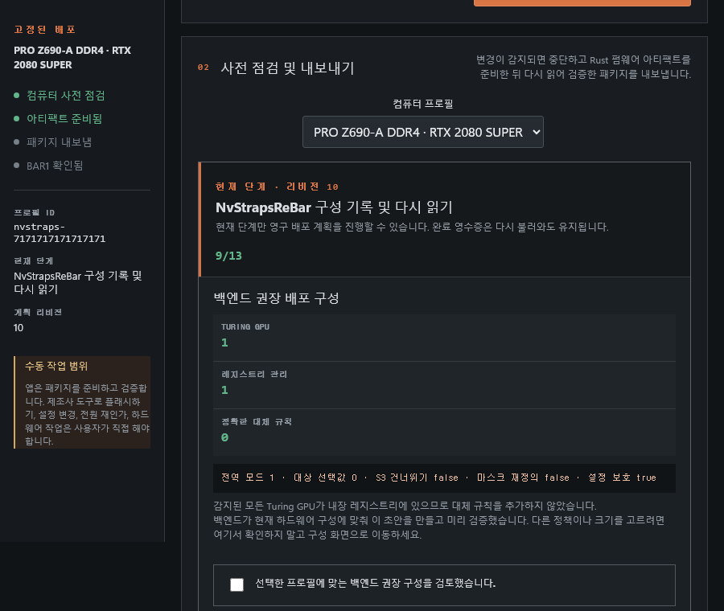

---

## 9. Pretendard로 다듬은 한국어 구성 화면

한국어를 선택하면 본문과 제목에 번들된 Pretendard가 적용됩니다. 기술값과
장치 정보는 기존 고정폭 글꼴을 유지합니다. 화면 상단의 노란 띠는 브라우저
미리보기 데이터임을 분명히 표시합니다.

[원본 크기로 보기](09-korean-pretendard-configure-1180x760.png)

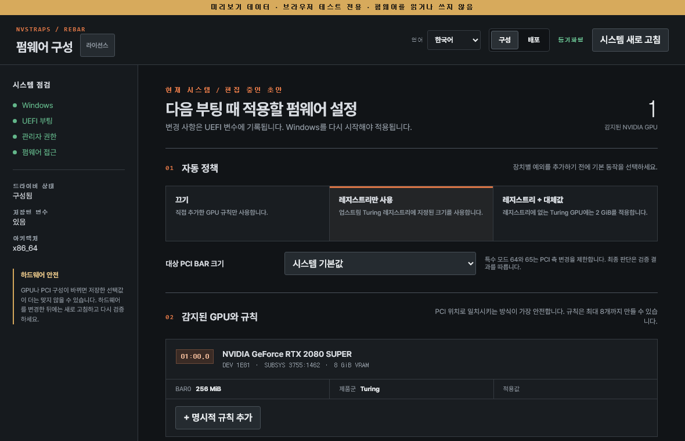

## 10. UEFI 기록 전 마지막 확인

구성 변수 기록 직전에 다시 확인하는 화면입니다. 감지된 GPU와 PCI 구성이
이 컴퓨터와 일치하는지 확인하도록 안내합니다. 미리보기에서는 펌웨어를
기록하지 않습니다.

[원본 크기로 보기](10-korean-write-confirmation-1180x760.png)

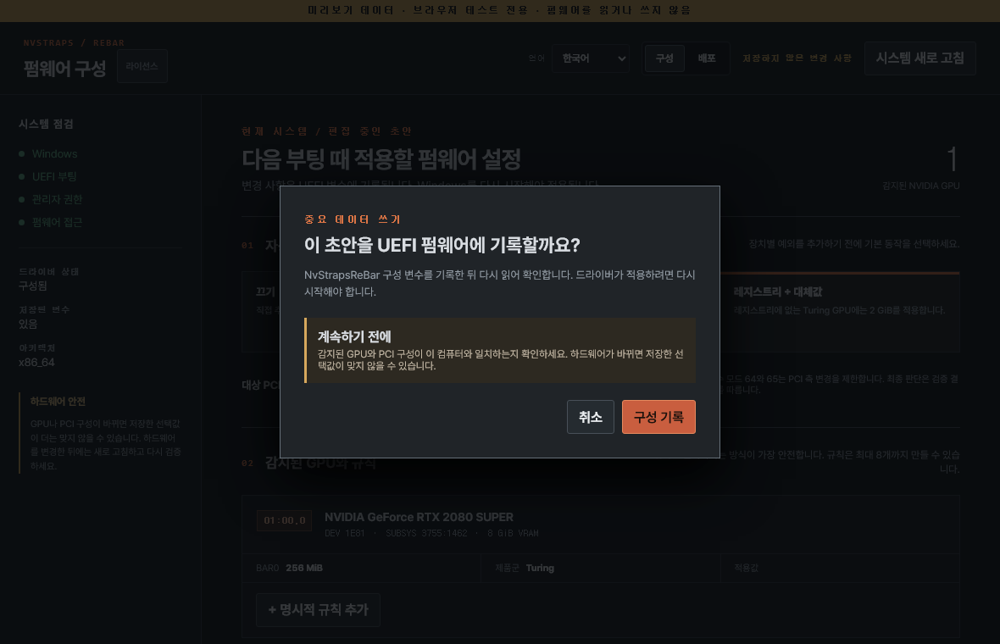

## 11. 현재 배포 단계와 수동 작업 범위

고정된 미리보기 프로필의 현재 단계와 아직 남은 배포 단계를 함께 보여줍니다.
제조사 도구, 펌웨어 설정, 전원 작업은 앱이 대신 완료하지 않는다는 경계도
그대로 보입니다.

[원본 크기로 보기](11-korean-deployment-active-step-900x760.png)

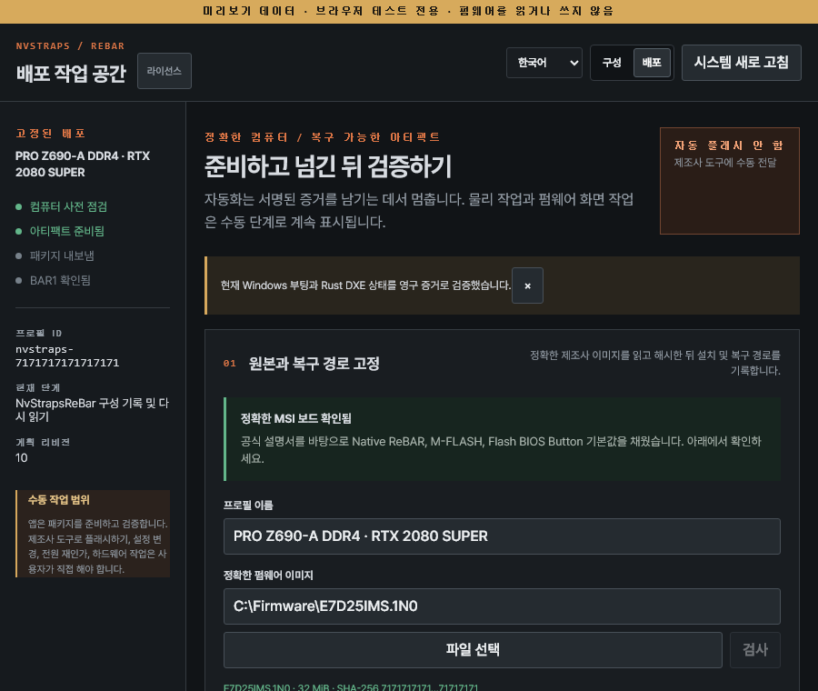

## 12. 앱 안에서 읽는 Pretendard 라이선스

Pretendard v1.3.9의 저작권 고지와 SIL OFL 1.1 전문을 앱 안에서 확인하는
화면입니다. 외부 페이지나 네트워크 연결 없이 번들된 라이선스를 읽습니다.

[원본 크기로 보기](12-korean-pretendard-license-900x760.png)

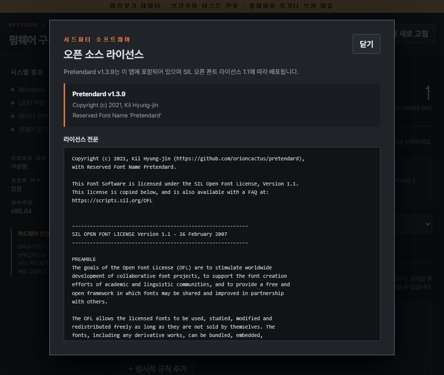

### 24. Settings file round-trip

The BAR Settings save area keeps a settings-file row: save the current
configuration to a JSON file before hardware changes or a CMOS clear, and load
it later to restore. Loading fills the editor draft and the normal review and
save path takes over.

[Open full-size image](24-settings-file-round-trip-1180x760.png)

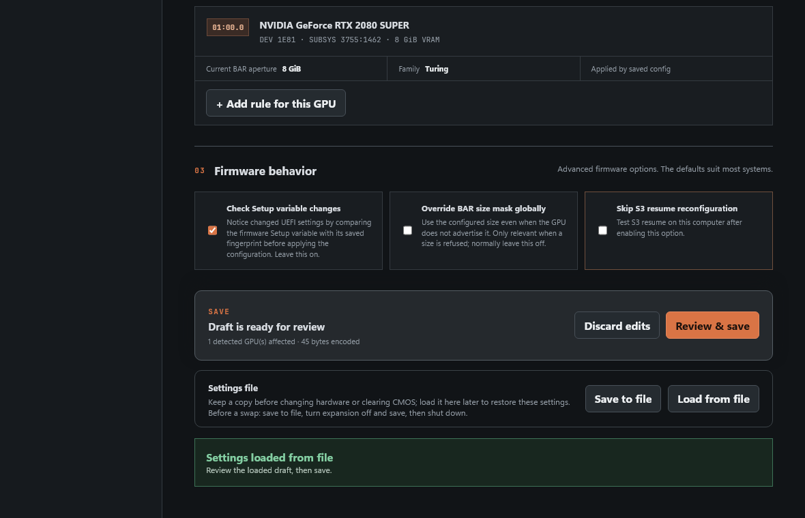

---

Captured on Windows with Chromium 151.0.7922.34, 1x device scale, and reduced
motion. Original English capture source: `7794b6d`. Initial Korean capture
source: `e53b28b`. Pretendard gallery capture source: `9492711`.
Current factual-copy capture source: `ffe4de9`.
